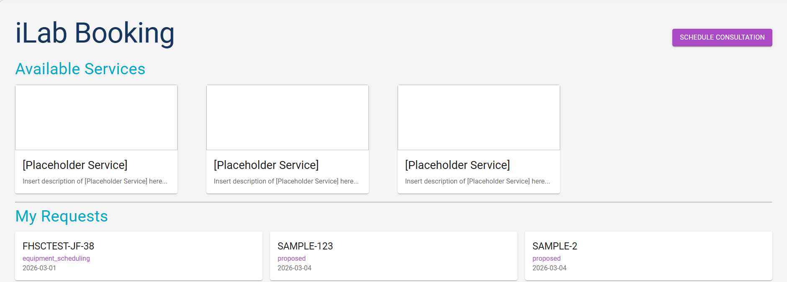

# iLab Booking
This application is a lightweight portal for interacting with iLab’s **Service Requests** system. It provides a simplified interface for viewing and managing requests, addressing the usability challenges of the native iLab platform. By streamlining access to key information, the app improves efficiency and reduces friction for users who regularly work with service requests.

*iLab Booking App Preview*


### Development Team
- Augy Markham   | [linkedin](https://www.linkedin.com/in/augy-markham/) | [github](https://github.com/AugleBoBaugles) |
- Jameson Farmer | [linkedin](https://www.linkedin.com/in/jameson-farmer) | [github](https://github.com/Jameson789) | 
- Rebecca Riffle | [linkedin](https://www.linkedin.com/in/rebecca-riffle/) | [github](https://github.com/rifflere) |

### Table of Contents
1. [Developer Instructions](#developer-instructions)
1. [Tech Stack + Architecture](#tech-stack--architecture)
1. [UI Design](#ui-design)

## Developer Instructions
### Prerequisites
- Node.js
- npm

### Environment Variables
Configure the app to connect to iLab.
1. Duplicate this env file ```server\template.env``` and name it ```.env```
2. In ```.env``` fill in ```ILAB_BASE_URL``` and ```ILAB_API_TOKEN```.
*If you don't fill these in, the app will not connect to iLab.*

NOTE: See [iLab API documentation](https://help.ilab.agilent.com/ilab-api) for help setting up a token.
### Running the App
*Be in root of project*

#### Mac / Linux 
```bash
npm run dev
``` 
#### Windows
``` bash
# Run this
bash scripts/start-dev.sh

# If that doesn't work, run this ->
chmod +x ./scripts/start-dev.sh && ./scripts/start-dev.sh
```

### Accessing the App
Once both services are running, the frontend will be available at:

http://localhost:3001

### Running Tests
*Be in root of project*

#### Mac / Linux
``` bash
npm run test
``` 
#### Windows
``` bash
# Run this
bash scripts/test-server.sh

# If that doesn't work, run this ->
chmod +x ./scripts/test-server.sh && ./scripts/test-server.sh
```

#### Expected Behavior

- ✅ If all tests pass → the script exits successfully.
- ❌ If any tests fail → the script exits with a non-zero status code (useful for CI).
- ❌ If Node/npm is not installed or `server/` is missing → the script prints an error and exits non-zero.

### Customizing the App
---
*These next steps are important to add specific functionality to the app*
---
### Update "Available Services"
To update the card in the "Available Services" section go to ```next-frontend\components\main-page\AvailableServices.jsx``` and update the "machines" in the grid.

#### Updating current services
1. For whichever service you are changing, replace "[Placeholder Service]" with your new service name.

#### Adding a new services

1. Copy this block into the grid and replace "[Placeholder Service]" with your service name.
```javascript
<Grid size={3}>
    <EquipmentCard machineName="[Placeholder Service]" />
</Grid>
```

---

### Update Consultation URL
The consultation URL is a link to your department calendar or email.
1. In this file `next-frontend\components\buttons\ScheduleButton.jsx` update the `CONSULTATION_URL` variable with your url.


---
## Tech Stack + Architecture
This monorepo contains a [frontend](#frontend), a [backend](#backend), [tests](#testing-strategy), and [scripts](#automation-scripts) to automate installation of dependencies and starting and testing the app.
### Frontend
The frontend is built with Next.js (App Router) using React functional components and client-side state where needed.
#### Frontend Tech Stack
- **Next.js** - Routing, project structure, and API proxying
    - Configured to connect to localhost server on port 3000 for API calls.
- **React hooks** - Local state management (useState, useEffect)
- **Material UI (MUI)** - Consistent design system and responsive layout
- **Component-driven structure** - Separation of UI, form logic, and data display
    - Equipment cards
    - Reservation cards
#### Frontend Structure
```
components/
  buttons/       → Consultation button logic
  form/          → Reservation form logic
  main-page/     → Service cards and request display
app/
  reserve/       → Reservation flow
  reservations/  → Request detail pages
```
### Backend
The backend is a lightweight Node.js + Express API that acts as a middleware layer between the frontend and the iLab API.
#### Backend Tech Stack
- **Express** - Simple REST API layer
- **Axios** - External API communication
- **dotenv** - Secure environment configuration
- **Layered architecture** - Clear separation of concerns
#### Backend Structure
```
routes/        → API endpoints
controllers/   → Request validation + response handling
services/      → External API communication
config/        → Environment configuration
tests/         → Unit + integration tests
```
#### Request Flow
```
Route → Controller → Service → iLab API
```
### Testing Strategy
Testing is done with **Vitest** and **Supertest**.
Test types included:
- **Unit tests** - Controller logic tested with mocked services
- **Service tests** - Axios mocked to avoid real API calls
- **Integration tests** - Route → controller → service flow tested together

Testing goals:
- Verify request validation
- Verify error handling
- Ensure route wiring works correctly
- Prevent regressions when modifying API logic

### Automation Scripts
The repository includes bash scripts to simplify local development and testing by automating dependency installation and startup tasks.

**Key scripts:**
- **start-dev.sh**
  - Installs dependencies for both frontend and backend
  - Starts the Express server and Next.js frontend together
  - Allows developers to start the full application from the project root with one command

- **test-server.sh**
  - Verifies required tools (Node/npm) exist before running tests
  - Validates expected project structure
  - Runs backend tests with clear failure messaging
  - Uses proper exit codes for CI compatibility

These scripts reduce setup friction and help ensure developers run the project in a consistent way.

### Overall Architecture Philosophy
This project follows a simple layered architecture optimized for maintainability:

- Clear separation between UI, API, and external services
- Small focused modules instead of large files
- Testable backend logic through isolation of services
- Minimal dependencies to keep the system lightweight

The goal is a system that is:
- Easy to extend
- Easy to test
- Easy to reason about
- Easy for new developers to onboard into quickly

## UI Design
### Wireframe
[Link to *initial* Wireframe](https://www.notion.so/PCI-Portal-Wireframe-3-3-3198414e033680f382efdf31b2740347?source=copy_link)
### Color Palette
<span style="display:inline-block;width:12px;height:12px;background:#18365D;border-radius:3px;margin-right:6px;"></span> Dark Navy `#18365D`

<span style="display:inline-block;width:12px;height:12px;background:#FFFFFF;border-radius:3px;margin-right:6px;"></span> White `#FFFFFF`

<span style="display:inline-block;width:12px;height:12px;background:#F4F4F4;border:1px solid #ccc;border-radius:3px;margin-right:6px;"></span> Light Grey `#F4F4F4`

<span style="display:inline-block;width:12px;height:12px;background:#00ABC8;border:1px solid #ccc;border-radius:3px;margin-right:6px;"></span> Bright Blue `#00ABC8`

<span style="display:inline-block;width:12px;height:12px;background:#FFB500;border:1px solid #ccc;border-radius:3px;margin-right:6px;"></span> Vivid Yellow `#FFB500`

<span style="display:inline-block;width:12px;height:12px;background:#AA4AC4;border:1px solid #ccc;border-radius:3px;margin-right:6px;"></span> Warm Purple `#AA4AC4`

<span style="display:inline-block;width:12px;height:12px;background:#0A799A;border:1px solid #ccc;border-radius:3px;margin-right:6px;"></span> Teal `#0A799A`
